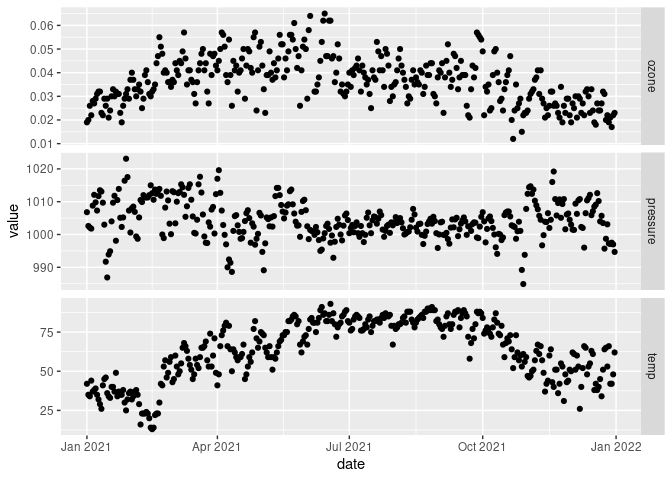

This tutorial will cover the following main functions from [dplyr](https://dplyr.tidyverse.org/)
and [tidyr](https://tidyr.tidyverse.org/):

- `mutate()` and `transmute()`
- `pivot_longer()`
- `pivot_wider()`

It also lists some other useful miscellaneous functions.

# Add new columns with mutate() and transmute()

In the first [Data Manipulation](training-r-intermediate/blob/initial-update/1-Data-Manipulation-1/readme.md)
tutorial we learned how to use the `group_by()` and `summarise()` functions to 
aggregate data. Those functions are useful in situations where you need to 
summarise data based on other columns, such as daily summaries for each site and
pollutant in a data set. 

But in some cases we may want a new value for each record in a data frame. For example, 
in the `chicago_air` data set from the `region5air` package, we may want a column 
that is a one day lag value of the ozone column. The `mutate()` function will
take the data frame provided in the first parameter and add additional parameters
as new columns.


```r
library(dplyr)
library(region5air)
data(chicago_air)

chicago_mutated <- mutate(chicago_air, ozone_lag1 = lag(ozone, n = 1))
head(chicago_mutated, 3)
```

```
## # A tibble: 3 × 7
##   date       ozone  temp pressure month weekday ozone_lag1
##   <date>     <dbl> <dbl>    <dbl> <dbl>   <dbl>      <dbl>
## 1 2021-01-01 0.019    42    1007.     1       6     NA    
## 2 2021-01-02 0.02     35    1003.     1       7      0.019
## 3 2021-01-03 0.026    34    1002.     1       1      0.02
```

Or we may want to calculate a the difference betwen the ozone value and a standard value.


```r
chicago_mutated <- mutate(chicago_mutated, diff_standard = ozone - 0.075)
head(chicago_mutated, 3)
```

```
## # A tibble: 3 × 8
##   date       ozone  temp pressure month weekday ozone_lag1 diff_standard
##   <date>     <dbl> <dbl>    <dbl> <dbl>   <dbl>      <dbl>         <dbl>
## 1 2021-01-01 0.019    42    1007.     1       6     NA            -0.056
## 2 2021-01-02 0.02     35    1003.     1       7      0.019        -0.055
## 3 2021-01-03 0.026    34    1002.     1       1      0.02         -0.049
```

`transmute()` works the same as `mutate()` except that it only returns the new columns.


```r
chicago_transmuted <- transmute(chicago_air, ozone_lag1 = lag(ozone, n = 1), 
                                diff_standard = ozone - 0.075)
head(chicago_transmuted, 3)
```

```
## # A tibble: 3 × 2
##   ozone_lag1 diff_standard
##        <dbl>         <dbl>
## 1     NA            -0.056
## 2      0.019        -0.055
## 3      0.02         -0.049
```

You can keep a column by including it as a parameter.


```r
chicago_transmuted <- transmute(chicago_air, date, ozone, lag1 = lag(ozone, n= 1))
head(chicago_transmuted, 3)
```

```
## # A tibble: 3 × 3
##   date       ozone   lag1
##   <date>     <dbl>  <dbl>
## 1 2021-01-01 0.019 NA    
## 2 2021-01-02 0.02   0.019
## 3 2021-01-03 0.026  0.02
```

# Reshaping with pivot_longer()

Often we have data in a format that is not convenient for a certain purpose. For
instance, we may look at the `chicago_air` data set


```r
head(chicago_air)
```

```
## # A tibble: 6 × 6
##   date       ozone  temp pressure month weekday
##   <date>     <dbl> <dbl>    <dbl> <dbl>   <dbl>
## 1 2021-01-01 0.019    42    1007.     1       6
## 2 2021-01-02 0.02     35    1003.     1       7
## 3 2021-01-03 0.026    34    1002.     1       1
## 4 2021-01-04 0.022    44    1002.     1       2
## 5 2021-01-05 0.028    37    1009.     1       3
## 6 2021-01-06 0.027    38    1012.     1       4
```

and wish that we could have one column with all the values and one column with 
all of the parameter names. The current format would be called wide, because it 
has the parameters spread out as columns. Since we want to pivot those column 
names into one column and make the data frame longer, we use the `pivot_longer()`
function in the `tidyr` package.


```r
library(tidyr)
chicago_long <- pivot_longer(chicago_air, cols = ozone:pressure, 
                             names_to = "parameter", values_to = "value")
head(chicago_long, 3)
```

```
## # A tibble: 3 × 5
##   date       month weekday parameter    value
##   <date>     <dbl>   <dbl> <chr>        <dbl>
## 1 2021-01-01     1       6 ozone        0.019
## 2 2021-01-01     1       6 temp        42    
## 3 2021-01-01     1       6 pressure  1007.
```


One reason to reshape data in this way is to make it easier to feed into a plotting
function such as `ggplot()`.


```r
library(ggplot2)
ggplot(chicago_long, aes(date, value)) + geom_point() + 
  facet_grid(parameter ~., scales = "free")
```

<!-- -->

# Reshape with pivot_wider()

We may also want to reshape data that is long into a wide format. Using the 
`chicago_long` data frame we just created, we can re-create the wide format using
`pivot_wider()`.


```r
chicago_wide <- pivot_wider(chicago_long, names_from = parameter,
                            values_from = value)

head(chicago_wide, 3)
```

```
## # A tibble: 3 × 6
##   date       month weekday ozone  temp pressure
##   <date>     <dbl>   <dbl> <dbl> <dbl>    <dbl>
## 1 2021-01-01     1       6 0.019    42    1007.
## 2 2021-01-02     1       7 0.02     35    1003.
## 3 2021-01-03     1       1 0.026    34    1002.
```

