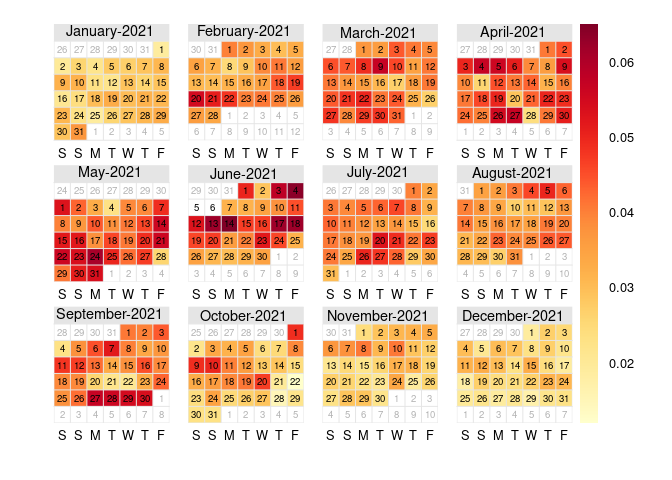

The [`openair` package](https://davidcarslaw.github.io/openair/) is specifically
designed to plot air pollution monitoring data. This tutorial will give a brief 
introduction to many of those functions.

# openair Data Format

Functions in the `openair` package generally have this format:


```r
functionName(the_data, options, ...)
```

The first parameter `the_data` must be a data frame (or similar type such as a
`tibble`). The data frame must have a date/time column, and it must be named `date`.
The class of the date/time column must be `Date`, `POSIXct`, or `POSIXlt`. 
Columns with wind speed and wind direction must be named `ws` and `wd` respectively.
See the 
[openair documentation](https://bookdown.org/david_carslaw/openair/sections/intro/openair-package.html)
for more guidance on the required data format.


We will use two data frames from the `region5air` package: `chicago_air` and
`chicago_wind`. Below, the data frames are loaded and columns are renamed to
meet the requirements of the `openair` package.


```r
library(region5air)
library(dplyr)
data(chicago_air)
data(chicago_wind)

chicago_wind <- rename(chicago_wind, ws = wind_speed, wd = wind_direction,
                       date = datetime)
```


# `summaryPlot`

The `summaryPlot()` function gives a plot of the data over time along
with summarizing details such as the min, max, and mean values. It also gives a 
histogram of the distribution.


```r
library(openair)
summaryPlot(select(chicago_air, date:pressure))
```

<!-- -->

The first column of the graph contains time series plots of all of the columns in 
the data frame (besides `date`). The red bars at the bottom of each panel shows 
where there are large segments of missing data. The panels on the right are the histograms
of the distributions for each parameter.

# `windRose`{#windrose}

The `windRose()` function expects a data frame with columns for wind speed and
wind direction labeled `ws` and `wd`, such as the `chicago_wind` data frame. The 
plot displays spokes that indicate the percentage of time the wind blows from a certain
direction, and the color represents the speed. 


```r
windRose(chicago_wind, key.footer = "knots") # default is m/s
```

<!-- -->

You can split the data frame by time periods by using the `type` argument. For
example, a type of `"weekday"` splits the data into 7 different plots for each
day of the week.


```r
windRose(chicago_wind, type = "weekday", key.footer = "knots")
```

<!-- -->

# `pollutionRose`{#pollutionrose}

You can make a similar plot that will display pollutant concentrations in relation to wind
direction.


```r
pollutionRose(chicago_wind, pollutant = "ozone")
```

<!-- -->

You can also look at the values by time periods.


```r
pollutionRose(chicago_wind, pollutant = "ozone", type = "month")
```

```
## Detected data with Daylight Saving Time.
```

<!-- -->

# `timePlot`

Time series plots can be easily produced using `timePlot()`. The `pollutant`
parameter identifies the columns to be plotted, and setting `y.relation` to
`"free"` allows each series to be plotted on its own scale.


```r
timePlot(chicago_air, pollutant = c("ozone", "temp", "pressure"),
         y.relation = "free")
```

<!-- -->

There is an option to normalize all of the values and group them in one plot. The
graph below plots the average for each month, normalized to the first day of the
time series, 2021-01-01. Other parameter options determine the type of line and
thickness.


```r
timePlot(chicago_air, pollutant = c("ozone", "temp", "pressure"),
         avg.time = "month", 
         normalise = "1/1/2021", lwd = 4, lty = 1,
         group = TRUE)
```

<!-- -->

# `calendarPlot`

`calendarPlot()` displays daily values in a calendar format.


```r
calendarPlot(chicago_air, pollutant = "ozone")
```

<!-- -->

```r
calendarPlot(chicago_wind, pollutant = "ozone", annotate = "ws")
```

<!-- -->
