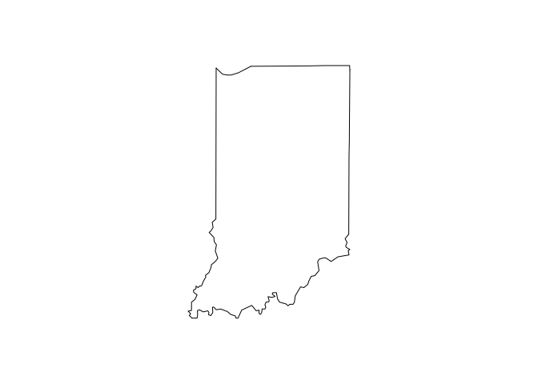
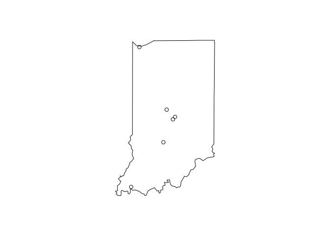
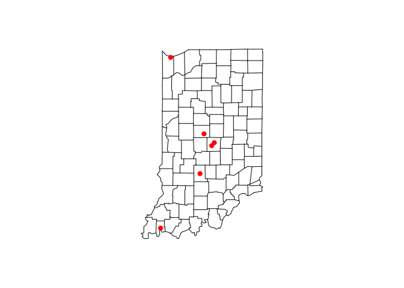
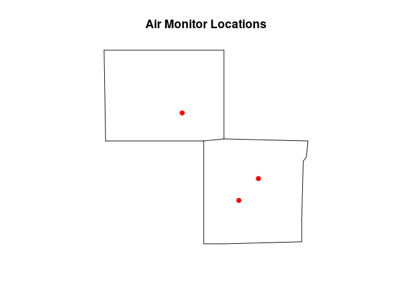
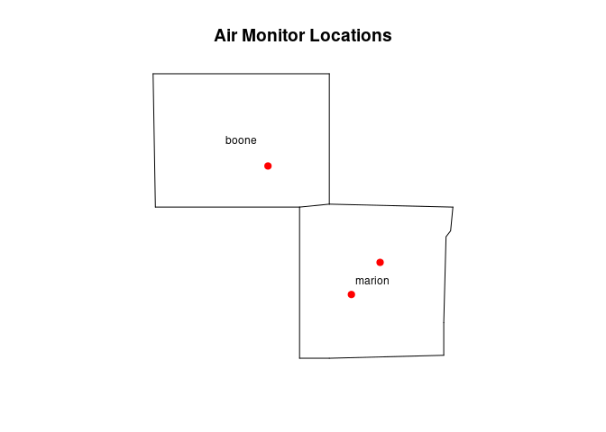
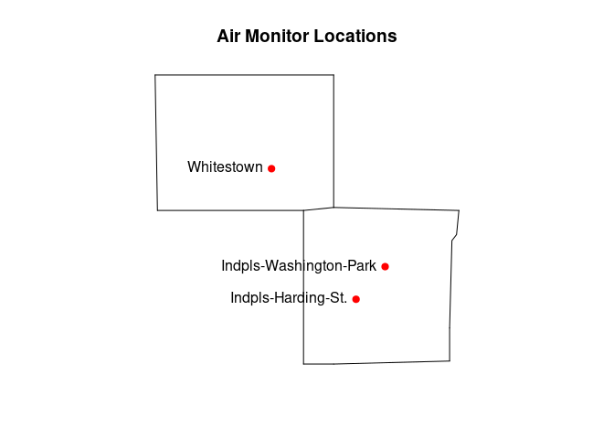

In this tutorial we'll cover the following topics:

* Basic Maps
* Google Maps
* Leaflet Maps


# Basic Maps

There is no function for displaying maps in the base R functionality. To display
a simple map, we use the `maps` package. First, let's create a simple Indiana map.


```r
library(maps)
map(database = 'state', regions = 'indiana')
```

<!-- -->

Now we can add a few monitors as points. Use the longitude column
as the x-axis values and longitude for the y-axis values.


```r
monitors <- read.table(header=T, text='
  monitorid        lat        long   datum                    name            
          1   41.60668  -87.304729   WGS84              Gary-IITRI
          2  39.811097	-86.114469   WGS84  Indpls-Washington-Park
          3  39.749019	-86.186314   WGS84      Indpls-Harding-St.
          4  38.013248	-87.577856   WGS84  Evansville-Buena-Vista
          5  39.159383	-86.504762   WGS84             Bloomington
          6  39.997484  -86.395172   WGS84              Whitestown
                       ')
```


<!-- -->

We can jazz it up a bit by making it a county map and changing the symbol type and
color.


```r
map(database = 'county', regions = 'indiana')
points(x = monitors$long, y = monitors$lat, pch = 19, col = 'red')
```

<!-- -->

We can also select specific counties to look at, and give the map a title.


```r
map(database = 'county', regions = c('indiana,marion', 'indiana,boone'))
points(x = monitors$long, y = monitors$lat, pch = 19, col = 'red')
title(main = "Air Monitor Locations")
```

<!-- -->

If we want the counties to be automatically labeled, we use the `map.text` 
function.


```r
map.text(database = 'county', regions = c('indiana,marion', 'indiana,boone'))
points(x = monitors$long, y = monitors$lat, pch = 19, col = 'red')
title(main = "Air Monitor Locations")
```

<!-- -->


And if we want to label the monitors, we use the `text()` function.


```r
map(database = 'county', regions = c('indiana,marion', 'indiana,boone'))
points(x = monitors$long, y = monitors$lat, pch = 19, col = 'red')
title(main = "Air Monitor Locations")
text(x = monitors$long, y = monitors$lat, labels = monitors$name, pos = 2)
```

<!-- -->


# Google Maps


To make interactive Google maps, we can use the `googleVis` package.


```r
library(googleVis)
```


We have to do some formatting first. The coordinates must be in the form `lat:long`
so we need to create a data frame with a variable in that format.


```r
op <- options(gvis.plot.tag='chart')
google.location <- paste(monitors$lat, monitors$long, sep = ":")
monitors.google <- data.frame(monitors, google.location)
gvisMap(data = monitors.google, locationvar = "google.location", tipvar = "name")
```

<!DOCTYPE html PUBLIC "-//W3C//DTD XHTML 1.0 Strict//EN"
  "https://www.w3.org/TR/xhtml1/DTD/xhtml1-strict.dtd">
<html xmlns="https://www.w3.org/1999/xhtml">
<head>
<title>MapID4965287748c</title>
<meta http-equiv="content-type" content="text/html;charset=utf-8" />
<style type="text/css">
body {
  color: #444444;
  font-family: Arial,Helvetica,sans-serif;
  font-size: 75%;
  }
  a {
  color: #4D87C7;
  text-decoration: none;
}
</style>
</head>
<body>
 <!-- Map generated in R 4.3.0 by googleVis 0.7.1 package -->
<!-- Wed Jul 26 20:32:43 2023 -->


<!-- jsHeader -->
<script type="text/javascript">
 
// jsData 
function gvisDataMapID4965287748c () {
var data = new google.visualization.DataTable();
var datajson =
[
 [
41.60668,
-87.304729,
"Gary-IITRI"
],
[
39.811097,
-86.114469,
"Indpls-Washington-Park"
],
[
39.749019,
-86.186314,
"Indpls-Harding-St."
],
[
38.013248,
-87.577856,
"Evansville-Buena-Vista"
],
[
39.159383,
-86.504762,
"Bloomington"
],
[
39.997484,
-86.395172,
"Whitestown"
] 
];
data.addColumn('number','Latitude');
data.addColumn('number','Longitude');
data.addColumn('string','name');
data.addRows(datajson);
return(data);
}
 
// jsDrawChart
function drawChartMapID4965287748c() {
var data = gvisDataMapID4965287748c();
var options = {};
options["showTip"] = true;

    var chart = new google.visualization.Map(
    document.getElementById('MapID4965287748c')
    );
    chart.draw(data,options);
    

}
  
 
// jsDisplayChart
(function() {
var pkgs = window.__gvisPackages = window.__gvisPackages || [];
var callbacks = window.__gvisCallbacks = window.__gvisCallbacks || [];
var chartid = "map";
  
// Manually see if chartid is in pkgs (not all browsers support Array.indexOf)
var i, newPackage = true;
for (i = 0; newPackage && i < pkgs.length; i++) {
if (pkgs[i] === chartid)
newPackage = false;
}
if (newPackage)
  pkgs.push(chartid);
  
// Add the drawChart function to the global list of callbacks
callbacks.push(drawChartMapID4965287748c);
})();
function displayChartMapID4965287748c() {
  var pkgs = window.__gvisPackages = window.__gvisPackages || [];
  var callbacks = window.__gvisCallbacks = window.__gvisCallbacks || [];
  window.clearTimeout(window.__gvisLoad);
  // The timeout is set to 100 because otherwise the container div we are
  // targeting might not be part of the document yet
  window.__gvisLoad = setTimeout(function() {
  var pkgCount = pkgs.length;
  google.load("visualization", "1", { packages:pkgs, callback: function() {
  if (pkgCount != pkgs.length) {
  // Race condition where another setTimeout call snuck in after us; if
  // that call added a package, we must not shift its callback
  return;
}
while (callbacks.length > 0)
callbacks.shift()();
} });
}, 100);
}
 
// jsFooter
</script>
 
<!-- jsChart -->  
<script type="text/javascript" src="https://www.google.com/jsapi?callback=displayChartMapID4965287748c"></script>
 
<!-- divChart -->
  
<div id="MapID4965287748c" 
  style="width: 500; height: automatic;">
</div>
 <div><span>Data: monitors.google &#8226; Chart ID: <a href="Chart_MapID4965287748c.html">MapID4965287748c</a> &#8226; <a href="https://mages.github.io/googleVis/">googleVis-0.7.1</a></span><br /> 
<!-- htmlFooter -->
<span> 
  R version 4.3.0 (2023-04-21) 
  &#8226; <a href="https://developers.google.com/terms/">Google Terms of Use</a> &#8226; <a href="https://developers.google.com/chart/interactive/docs/gallery/map">Documentation and Data Policy</a>
</span></div>
</body>
</html>


# Leaflet Maps


Leaflet is another interactive map that can be created in R using the `leaflet`
package.


```r
library(leaflet)
m <- leaflet()
m <- addTiles(m)
m <- addMarkers(m, lng=monitors$long, lat=monitors$lat, 
                popup=monitors$name)
m
```

```{=html}
<div class="leaflet html-widget html-fill-item-overflow-hidden html-fill-item" id="htmlwidget-aa9ba3cbb05647289066" style="width:672px;height:480px;"></div>
<script type="application/json" data-for="htmlwidget-aa9ba3cbb05647289066">{"x":{"options":{"crs":{"crsClass":"L.CRS.EPSG3857","code":null,"proj4def":null,"projectedBounds":null,"options":{}}},"calls":[{"method":"addTiles","args":["https://{s}.tile.openstreetmap.org/{z}/{x}/{y}.png",null,null,{"minZoom":0,"maxZoom":18,"tileSize":256,"subdomains":"abc","errorTileUrl":"","tms":false,"noWrap":false,"zoomOffset":0,"zoomReverse":false,"opacity":1,"zIndex":1,"detectRetina":false,"attribution":"&copy; <a href=\"https://openstreetmap.org\">OpenStreetMap<\/a> contributors, <a href=\"https://creativecommons.org/licenses/by-sa/2.0/\">CC-BY-SA<\/a>"}]},{"method":"addMarkers","args":[[41.60668,39.811097,39.749019,38.013248,39.159383,39.997484],[-87.30472899999999,-86.114469,-86.186314,-87.577856,-86.504762,-86.395172],null,null,null,{"interactive":true,"draggable":false,"keyboard":true,"title":"","alt":"","zIndexOffset":0,"opacity":1,"riseOnHover":false,"riseOffset":250},["Gary-IITRI","Indpls-Washington-Park","Indpls-Harding-St.","Evansville-Buena-Vista","Bloomington","Whitestown"],null,null,null,null,{"interactive":false,"permanent":false,"direction":"auto","opacity":1,"offset":[0,0],"textsize":"10px","textOnly":false,"className":"","sticky":true},null]}],"limits":{"lat":[38.013248,41.60668],"lng":[-87.577856,-86.114469]}},"evals":[],"jsHooks":[]}</script>
```


